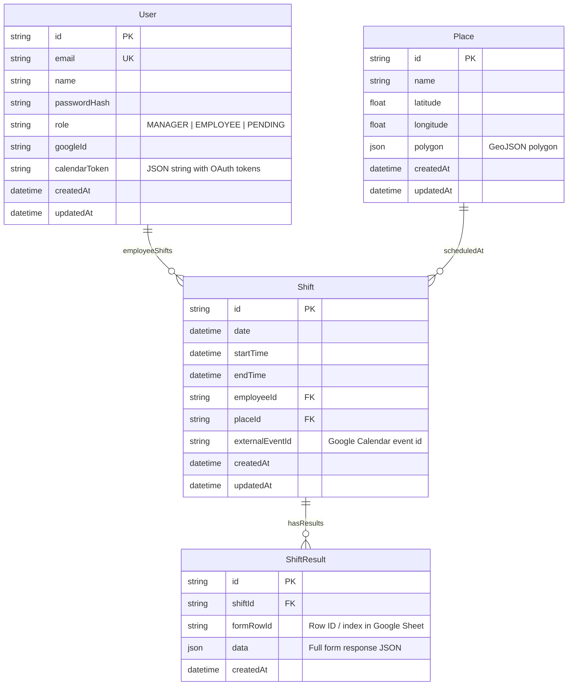

## ER Diagram – Duty Shift Management System

### Notes

- `User.role` is an enum with values `MANAGER`, `EMPLOYEE`, `PENDING`.
- `User.calendarToken` stores the raw OAuth tokens JSON used to access the employee's Google Calendar.
- `Shift.externalEventId` stores the ID of the corresponding Google Calendar event.
- `ShiftResult.data` mirrors the row values from the Google Sheet associated with the Google Form.

