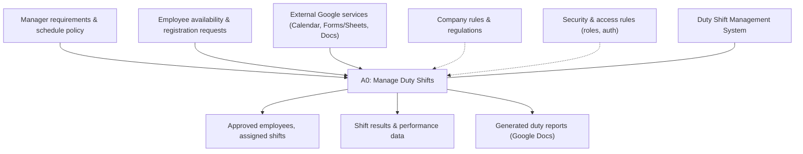
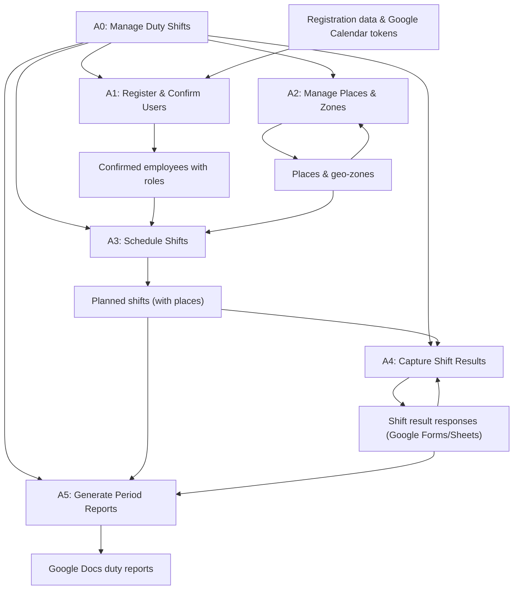

## IDEF0 Description – Duty Shift Management System

The following Mermaid diagram approximates an IDEF0 A-0 and A0 level decomposition of the Duty Shift Management System business process.

### A0 Decomposition (First-Level)

#### A1: Register & Confirm Users
- Inputs: registration forms, Google Calendar OAuth token JSON, manager confirmation actions.
- Controls: access rules, role definitions (PENDING, EMPLOYEE, MANAGER).
- Mechanisms: Next.js UI, NextAuth, Prisma, PostgreSQL.
- Outputs: stored users, confirmed employees with roles.

#### A2: Manage Places & Zones
- Inputs: place definitions, map polygons and coordinates.
- Controls: geography constraints and company zoning rules.
- Mechanisms: React Leaflet map, polygon drawing tools, Prisma.
- Outputs: persistent `Place` records with polygons and coordinates.

#### A3: Schedule Shifts
- Inputs: confirmed employees, places, desired dates and times.
- Controls: schedule policies, working-hours constraints.
- Mechanisms: manager UI, Prisma, Google Calendar API using stored tokens.
- Outputs: `Shift` records, Google Calendar events with notifications.

#### A4: Capture Shift Results
- Inputs: employee submissions via Google Form.
- Controls: result form schema, validation rules.
- Mechanisms: Google Forms & Sheets, backend reader using service account.
- Outputs: `ShiftResult` entries tied to shifts.

#### A5: Generate Period Reports
- Inputs: reporting period, shifts and results.
- Controls: report template, company KPIs.
- Mechanisms: Prisma queries, Google Docs API using service account.
- Outputs: Google Docs report URL shared with manager.

