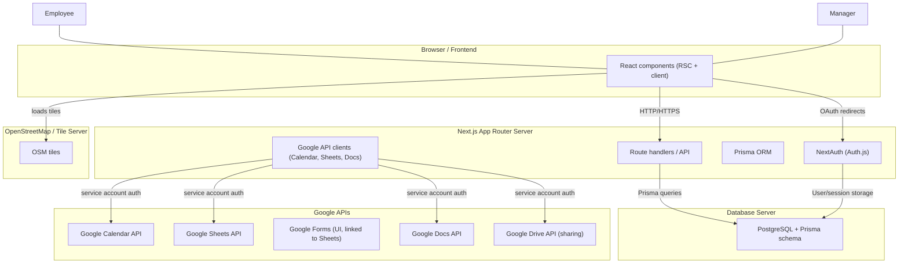

## UML Deployment Diagram – Duty Shift Management System

### Node Responsibilities

- **Browser / Frontend**
  - Renders Next.js pages and React components.
  - Hosts React Leaflet map for place/zone drawing.
  - Initiates auth via NextAuth, interacts with API routes.

- **Next.js Server**
  - App Router server rendering.
  - Route handlers for registration, user confirmation, shift CRUD, report generation.
  - NextAuth for Google OAuth and credentials authentication.
  - Uses Prisma client to access PostgreSQL.
  - Hosts Google API integration utilities (Calendar for shift events, Sheets for results, Docs for reports).

- **Database Server (PostgreSQL)**
  - Stores users, roles, places, shifts, and shift result metadata.
  - Enforces relational integrity as per ERD.

- **Google APIs**
  - **Calendar API** – stores employee shift events with reminders.
  - **Forms + Sheets** – collects and stores shift result submissions.
  - **Docs API** – generates duty reports for manager‑selected periods.
  - **Drive API** – manages sharing / permissions for created Docs.

- **OpenStreetMap / Tile Server**
  - Provides map tiles and geographic background used in React Leaflet for defining zones.

