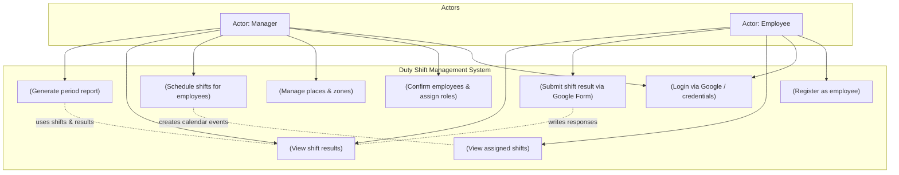

## UML Use Case Diagram – Duty Shift Management System

### Main Use Cases

- **Register as employee** – self‑registration with email, name, and Google Calendar token JSON.
- **Login via Google / credentials** – authentication either via Google OAuth (employees) or credentials (default manager).
- **Confirm employees & assign roles** – manager approves `PENDING` users and assigns them the `EMPLOYEE` role.
- **Manage places & zones** – manager defines locations on a map using polygons with coordinates.
- **Schedule shifts for employees** – manager assigns a date/time/place and writes to employee Google Calendar.
- **View assigned shifts** – employees see their upcoming duties pulled from the app DB (and optionally from Calendar).
- **Submit shift result via Google Form** – employees open a Google Form to log duty outcomes.
- **View shift results** – managers/employees view parsed responses from the Google Sheet.
- **Generate period report** – manager requests a report that becomes a Google Doc summarizing shifts and results.

